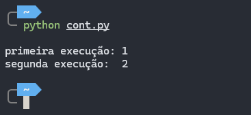

# Efeitos colaterais (side effects)
Na computação, dizemos que algo possui algum efeito colateral caso haja algum outro efeito observável que não seja o seu efeito primário (ler os argumentos e retornar).<br>
Isso quer dizer que uma função possui efeitos colaterais caso altere o estado do programa sem ser pelo seu retorno.<br>
O efeito colateral mais comum é uma atribuição à uma variável global.<br>

### O que pode ser um efeito colateral? 
- Modificar uma variável não local, variável local estática ou um argumento passado por referência
- Lançar erros ou exceções
- Entrada/saída de dados
- Chamar outras funções com efeitos colaterais

### Qual o problemas dos efeitos colaterais?
Na presença de efeitos colaterais, o comportamento de um programa pode depender de sua ordem de execução no programa, uma vez que outra expressão pode modificar o valor de uma variável que está em uso.<br>
Entender e _debugar_ uma função com efeitos colaterais requer um entendimento do contexto em que ela está sendo executada. <br>

### Função com efeito colateral
A seguinte função incrementa uma variável global iniciada em 0. Em cada chamada estamos printando o valor retornado. 
```python
contador = 0

def incremento():
  global contador
  contador += 1
  return contador

print(incremento())
print(incremento())
```



### Paradigmas x Efeitos colaterais
O paradigma adotado interfere diretamente no uso dos efeitos colaterais, um ótimo exemplo é na comparação entre os paradigmas **Imperativo** e **Declarativo**.
- Imperativo: utiliza os efeitos colaterais ao seu favor, pois funciona através da atualização do estado de um sistema.
- Declarativo: diferentemente da anterior, a programação declarativa apenas relata o estado do sistema, sem efeitos colaterais.

O paradigma funcional busca minimizar/eliminar os efeitos colaterais. A falta desses efeitos facilita a *verificação formal* do programa. <br>

A linguagem Haskell elimina os efeitos colaterais, como os de E/S e outras computações "stateful" (mantém informações sobre o estado). Isso é feito através da substituição por **Mônadas**. <br>

- Mônada: uma maneira de estruturar os cálculos como uma sequência de etapas, onde cada etapa não produz apenas um valor, mas também informações extras sobre a computação, como falhas potenciais, não determinismo, efeitos colaterais.<br><br>

### Função Pura
Uma função pura, em programação funcional, é aquela que não tem nenhum efeito e nem faz uso de nenhum estado fora da função. Temos 3 critérios:
- A função sempre deve retornar o mesmo _output_ quando receber a mesma entrada;
- A função não pode ter efeitos colaterais;
- A função deve ter transparência referencial, ou seja, depende apenas de seu input;
Uma função pura é determinística e não possui efeitos colaterais.<br>

### Função pura (Haskell)
Haskell tenta eliminar os efeitos colaterais, então todas as funções são puras, a não ser que utilizemos E/S de dados.
```haskell
-- sempre que utilizarmos as mesmas entradas, teremos as mesmas saídas
soma :: Int -> Int -> Int
soma a b = a + b
```


# Imutabilidade
Em ciência da computação, imutabilidade é um conceito que se refere à propriedade de um objeto não poder ser modificado ou alterado após a sua criação. Uma vez que um objeto imutável é criado o seu estado não pode ser alterado. Caso haja a necessidade de mudança, um novo objeto é tipicamente criado com as mudanças desejadas, mantendo o original. <br>
O conceito de imutabilidade é muito utilizado na **programação funcional**.

### Benefícios da imutabilidade
- Previsibilidade: esses objetos mantém um estado consistente, facilitando o entendimento sobre seu comportamento.
- Simultaneidade: a imutabilidade torna o acesso de vários threads/processos a um dado mais seguro e sem precisar se preocupar tanto com a sincronização.
- Depuração: simplifica a depuração de um programa, pois podemos confiar que os dados não mudarão inesperadamente. Também reduz o potencial de **efeitos colaterais**.
- Programação Funcional: permite funções puras, que geram a mesma saída para as mesmas entradas.
- Performance: reduz a sobrecarga de memória e melhora a eficiência de alocação de memória.
Dentre outros benefícios.<br>

### Tuplas em Python
O seguinte código mostra exemplos do que podemos/não podemos fazer em um objeto imutável (nesse caso, nas tuplas).<br>
Obs: podemos pensar nas tuplas como "listas imutáveis", apesar delas terem algumas outras diferenças.
```python
# ex. com lista
minha_lista = [1, 2, 3]
minha_lista[0] = 4

# ex. com tuplas
minha_tupla = (1, 2, 3) 
minha_tupla[0] = 4
```


# Fontes

### Efeitos Colaterais
- [Paradigmas de Programação: Uma Abordagem Comparativa - **5.2 Efeitos Colaterais**](https://leandromoh.gitbooks.io/tcc-paradigmas-de-programacao/content/5_paradigma_funcional/52_efeitos_colaterais.html)

- [Side effect (computer science)](https://en.wikipedia.org/wiki/Side_effect_(computer_science)#:~:text=In%20computer%20science%2C%20an%20operation,the%20invoker%20of%20the%20operation.)

- [JavaScript Overview — Functional Programming (Immutability, Side Effects, Pure Functions, HOFs)](https://antsitvlad.medium.com/introduction-to-functional-programming-immutability-side-effects-pure-functions-hofs-a3163494033)
### Imutabilidade
- [Immutable Data Structures: Advantages and Implementation in Modern Web Development](https://medium.com/@livajorge7/immutable-data-structures-advantages-and-implementation-in-modern-web-development-e68216450122)

- [What is Immutability in Software Design?](https://cemrekarakas.com/posts/2023/09/07/What-is-Immutability-in-Software-Design#:~:text=Immutability%20is%20a%20concept%20in,predictability%20and%20consistency%20are%20crucial.)

- [Immutable object](https://en.wikipedia.org/wiki/Immutable_object)

### Outros
- [Tupla no Python: o que é, como criar e manipular e suas diferenças com as Listas](https://www.alura.com.br/artigos/conhecendo-as-tuplas-no-python)
